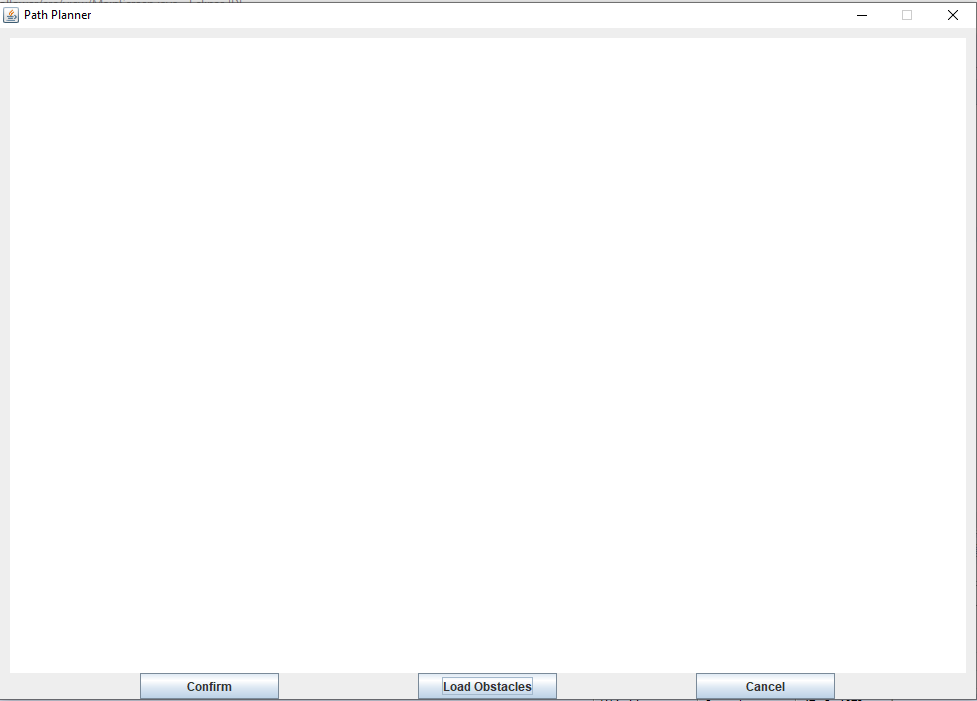
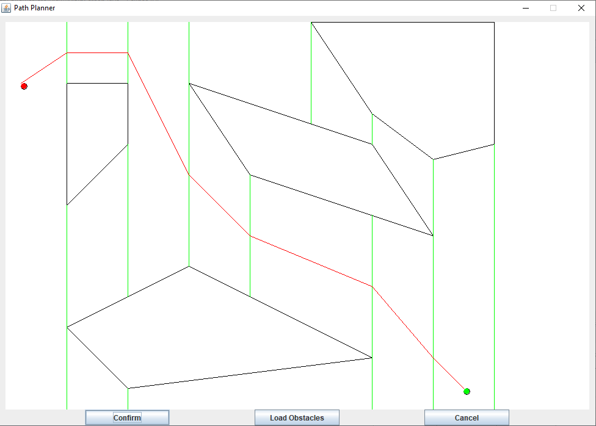

# Planejador de caminhos 

O algoritmo de planejador de caminhos foi feito utilizando a abordagem de decomposição exata, onde o espaço livre foi dividido em trapezoidais através de linhas 
verticais desenhadas a partir dos vértices dos obstáculos. Depois ele pega os pontos médios de duas linhas adjacentes e conecta-os, formando  o grafo de conectividade. 
A partir do grafo usa-se o algoritmo A* para encontrar o menor caminho entre o ponto de largada e o ponto de chegada. 

## Como utilizar o planejamento de caminho 
Antes de executar o código do programa, é necessário criar um arquivo de configuração,na pasta examples, é possível encontrar dois exemplos desses arquivos. 
No arquivo de configuração é colocado os pontos de partida e chegada, e os obstáculos do mapa. 

Para criar um arquivo de configuração,primeiro é necessário colocar os pontos de início, indicando com a palavra START e na linha abaixo as coordenada x ; y 
(nesse formato), e com a palavra END o ponto de chegada, seguindo o mesmo formato, e após isso, para definir os obstáculos é necessário utilizar a tag (Obs) 
e na próxima linha, os pontos incluídos no mesmo, seguindo esse formato xi ; yi - xf ; yf.Um exemplo de um arquivo está ilustrado abaixo: 

 

Após terminado o arquivo de configuração, salve-o na pasta do projeto.Execute o programa,e a interface irá aparecer na tela.

 

Aperte o botão **load obstacles** para escolher o arquivo de obstáculos, assim os mesmos serão renderizados na tela assim, como os pontos de partida(na cor vermelha) 
e chegada(na cor verde). Caso queira escolher outro arquivo de obstáculos aperte o botão **cancel**, e repita o processo. 

Aperte o botão **confirm** para o caminho ser gerado e apresentado na tela.

 

##Divisão