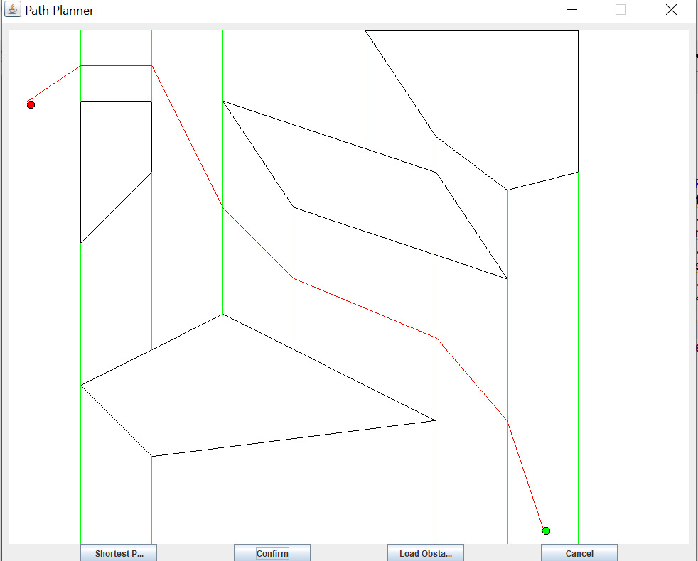
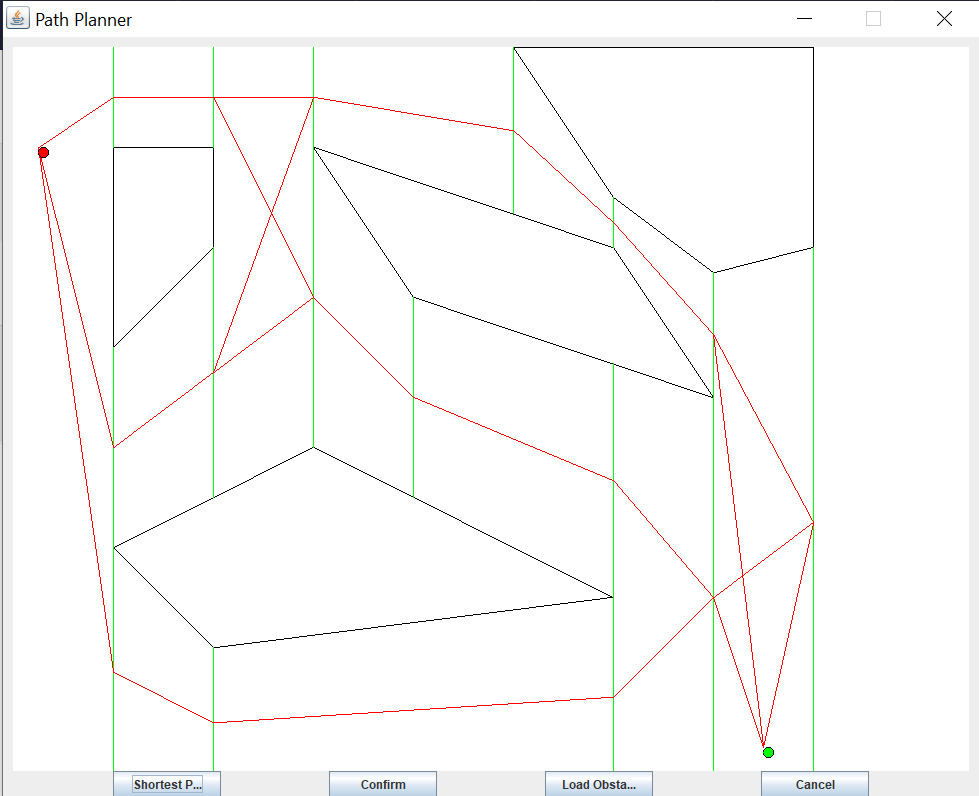

# Planejador de caminhos 

O algoritmo de planejador de caminhos foi feito utilizando a abordagem de decomposição exata, onde o espaço livre foi dividido em trapezoidais através de linhas 
verticais desenhadas a partir dos vértices dos obstáculos. Depois ele pega os pontos médios de duas linhas adjacentes e conecta-os, formando  o grafo de conectividade. 
A partir do grafo usa-se o algoritmo A* para encontrar o menor caminho entre o ponto de largada e o ponto de chegada. 

## Como criar o arquivo de Configuração
Antes de executar o código do programa, é necessário criar um arquivo de configuração,na pasta examples, é possível encontrar dois exemplos desses arquivos. 
No arquivo de configuração é colocado os pontos de partida e chegada, e os obstáculos do mapa. 

Para criar um arquivo de configuração,primeiro é necessário colocar a palavra **HEADER**,representando o inicio do arquivo, para indicar coodernadas do ponto de partida é utilizado palavra **START**, e na próxima linha as respectivas coordenadas x ; y 
(nesse formato), na próxima linha, com a palavra **END** o ponto de chegada, seguindo o mesmo formato explicado anteriormente, após isso, para definir os obstáculos é necessário utilizar a tag (ObsN) 
e na linha abaixo, os pontos incluídos no obstáculo, seguindo esse formato xi ; yi - xf ; yf. Depois que o arquivo de configuração for finalizado, salve-o na pasta do 
projeto. Um exemplo de um arquivo de configuração está ilustrado abaixo: 

 

##Como executar o programa

Para iniciar a aplicação, execute  o arquivo App.java na pasta app ou clique no arquivo executável .jar com o nome Finder, e a interface irá aparecer na tela.

 

##Como utilizar a aplicação

Aperte o botão **load obstacles** para escolher o arquivo de obstáculos, assim os mesmos serão renderizados na tela assim, como os pontos de partida(na cor vermelha) 
e chegada(na cor verde). Caso queira escolher outro arquivo de obstáculos aperte o botão **cancel**, e repita o processo. 

Aperte o botão **confirm** para o menor caminho entre o pontos ser calculado e apresentado na tela.

 

Caso o usuário deseje observar todos os caminhos encontrados pelo algoritmo, basta clicar no botão **Shortest Path**, e esse tipo de visualização vai ser ativado, para 
desativar, clique novamento no botão. Quando o  botão estiver com a palavra **on**, só irá aparecer o menor caminho, e com a palavra **off** todos os caminhos encontrados. 

